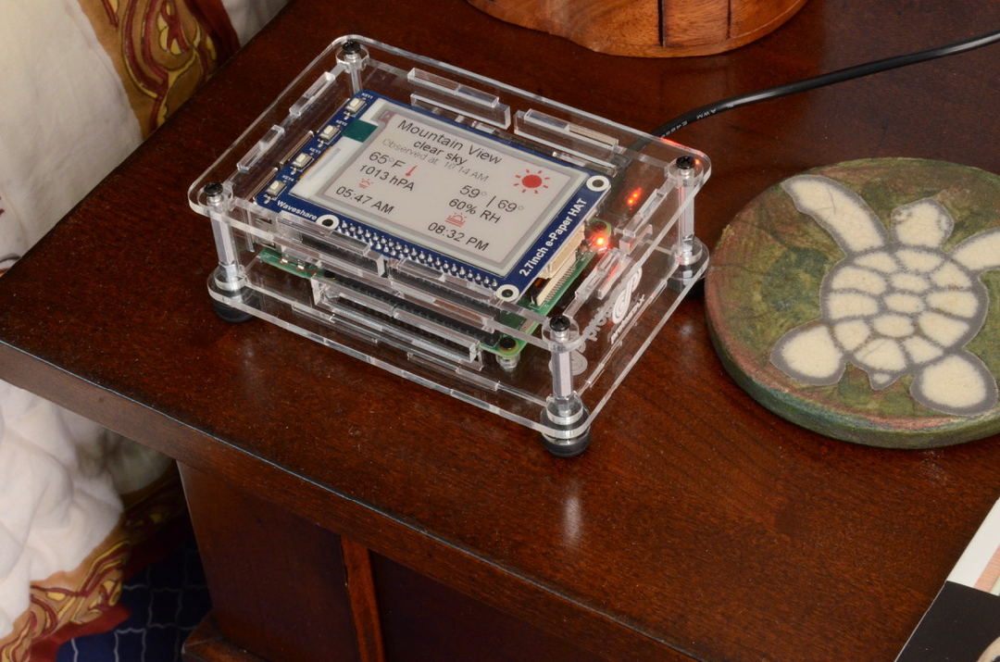

# ProtoStax_Weather_Station_Demo
Demo for ProtoStax Weather Station with ePaper Display and Raspberry Pi



using [ProtoStax for Raspberry Pi B+](https://www.protostax.com/products/protostax-for-raspberry-pi-b)

## Prerequisites

* Enable SPI on the Raspberry Pi
* API Key from Open Weather Map  - [https://openweathermap.org/api](https://openweathermap.org/api)
* City ID from Open Weather Map for the city of your choice - see
main.py comments for more details
* Python 3 or higher. The code and the ePaper library assumes you are
  using Python 3 or higher! (with Raspbian Buster, the latest is
  Python3.7)

**Install spidev, RPi.gpio and Pillow**

```
sudo apt-get install python3-spidev
sudo apt-get install rpi.gpio
sudo apt-get install python3-pil
```

## Installing

This demo uses the PyOWM library - see
[https://github.com/csparpa/pyowm](https://github.com/csparpa/pyowm)

It also uses Waveshare's ePaper libary - see
[https://github.com/waveshare/e-Paper](https://github.com/waveshare/e-Paper)

but includes the necessary files from that library directly, so you
**don't need to install anything extra**!

**NOTE - Use pip3!**

*Note: The latest version of PyOWM (3.0.0 as of this statement) is a major update, and has some breaking changes]. For this tutorial to work, we'll stick to the version 2.10.0. You can install that version by adding ==2.10.0 to the package name in the command below (it has already been added for you)*

```
sudo pip3 install pyowm==2.10.0
git clone https://github.com/protostax/ProtoStax_Weather_Station_Demo.git
```

## Usage

```
cd ProtoStax_Weather_Station_Demo
```

Edit main.py and add your Open Weather Map API key and City ID for the
city whose weather report you like

**NOTE - Using Python 3 or higher!**

```
python3.7 main.py
```

## License

Written by Sridhar Rajagopal for ProtoStax. BSD license, all text above must be included in any redistribution

A lot of time and effort has gone into providing this and other code. Please support ProtoStax by purchasing products from us!
Also uses the Waveshare ePaper library. Please support Waveshare by purchasing products from them!


